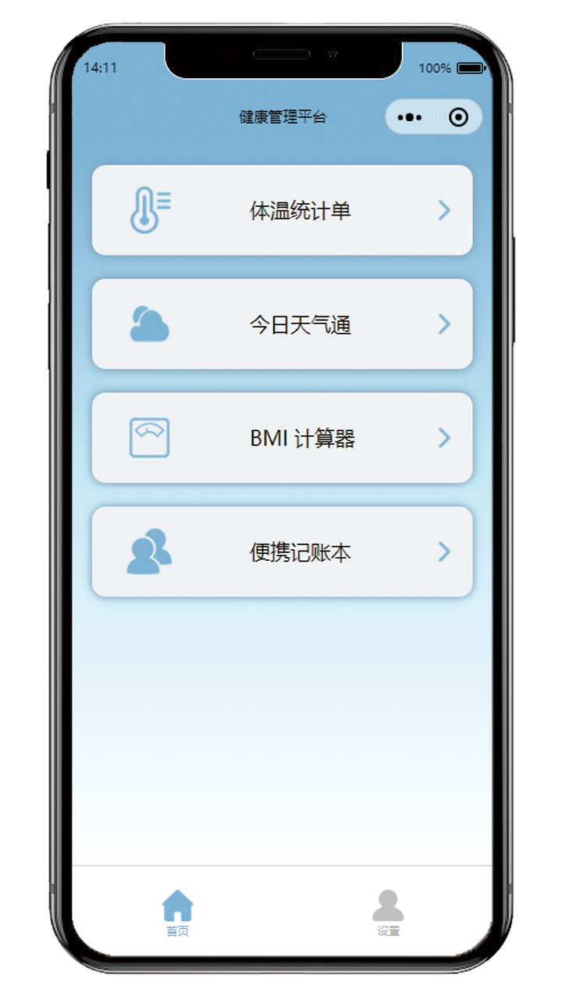

# 
 健康管理工具箱

## 关于

本项目基于微信小程序进行制作，需使用微信云开发平台数据库，本地编译前请创建相应的数据集合。

## 使用说明

### 用户信息注册

进入设置界面，使用微信账户登录，点击「编辑信息」即可修改账户的姓名和所在位置。

### 首页介绍
 
在小程序首页设有多个工具的入口。温度统计单页面即为与人脸识别与红外测温模块互联的管理页面；今日天气通可以查询我国主要城市当天的天气信息；BMI 计算器可以计算用户的身体质量指数；便携记账本提供了便捷的记账服务，该项服务为拓展功能，开发者可以根据用户需求添加各式各样的功能。

### 体温统计单
  
进入「体温统计单」页面，即可通过统计图直观观察到最近7天的体温变化情况。点击上部的「查看全部统计信息」，即可查看到用户测量过的全部体温信息。对任意一条信息向左滑动，即可删除该条信息。点击下方的「+」号，能够手动添加额外的温度测量信息。本产品注重用户隐私情况，因此该信息只有用户自己和管理员能够查看。

### 今日天气通
 
进入「今日天气通」页面，在「选择城市」一栏中选择需要查询的城市名称，点击「查询」按钮即可查询到天气信息。该功能使用了「心知天气」的天气信息API接口。

### BMI 计算器
 
进入「BMI 计算器」页面，通过调整身高和体重的数值，点击「计算」即可在上方显示用户的 BMI 数值，同时显示出身体状况和标准体重。

### 家庭记账本
 
进入「家庭记账本」页面，点击右下角的「+」号即可添加收支记录，包括收支名称、金额、日期等信息。
